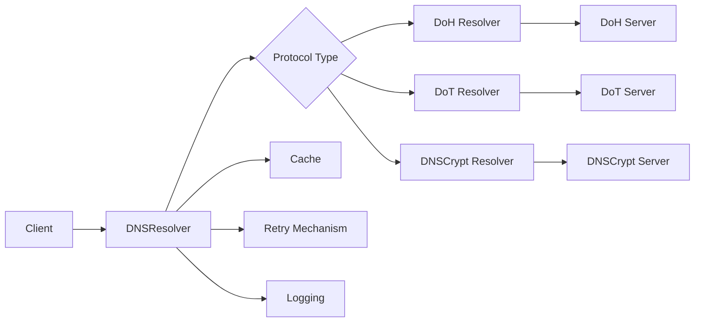
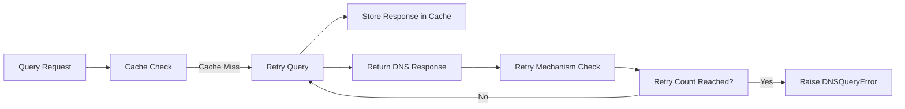
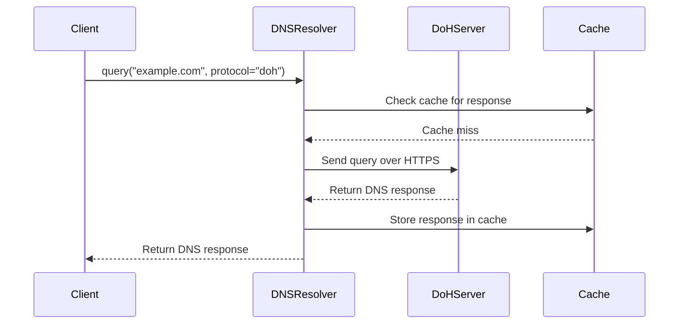

# PrivyDNS Architecture

The **PrivyDNS** library provides a robust, secure DNS querying solution with support for DNS over HTTPS (DoH), DNS over TLS (DoT), and DNSCrypt. It incorporates features such as **caching**, **retry mechanisms**, and **logging** to improve performance and reliability.

## High-Level Architecture

### Key Parts
1. **Client**: Initiates DNS queries, providing a domain name and the desired protocol.
2. **DNSResolver**: The main class handling DNS queries. It detects the protocol type (DoH, DoT, or DNSCrypt) and forwards the query to the respective resolver.
3. **DoH Resolver**: Sends DNS queries over HTTPS (DoH) using an HTTP client like `httpx` to communicate with the DoH server.
4. **DoT Resolver**: Sends DNS queries over TLS (DoT) using `dns.query.tls` for secure communication with the DoT server.
5. **DNSCrypt Resolver**: Encrypts DNS queries using **NaCl** and sends them to a DNSCrypt server for encrypted DNS resolution.
6. **Cache**: Stores DNS responses temporarily to avoid re-querying the same domain repeatedly.
7. **Retry Mechanism**: Ensures that failed queries are retried a specified number of times before raising an error.
8. **Logging**: Provides detailed logs about query operations, errors, cache hits/misses, and retry attempts.

## API Overview

### `DNSResolver`
- **Purpose**: Resolves DNS queries using DoH or DoT protocols.
- **Methods**:
	- `query(domain, record_type, protocol, async_mode)`: Resolves a DNS query.
	- `_query_doh(domain, record_type)`: Resolves a DNS query using DoH.
	- `_query_dot(domain, record_type)`: Resolves a DNS query using DoT.

### `DNSCryptResolver`
- **Purpose**: Resolves DNS queries using DNSCrypt.
- **Methods**:
	- `query(domain, record_type)`: Resolves a DNS query using DNSCrypt.

### **Error Handling**
- **DNSQueryError**: Custom exception class used to handle DNS-related errors such as query failures.

## Cache & Retry Mechanism

- **Cache**: Before making a request to the server, we check if the response is already cached. If it is, we return the cached response.
- **Retry**: If a DNS query fails, the system retries the query a specified number of times before raising a `DNSQueryError`.

---

## Sequence of Events (DoH Query Example)

## Conclusion

PrivyDNS is designed with **security**, **performance**, and **reliability** in mind. It supports encrypted DNS protocols, efficient caching, and automatic retries to ensure that DNS queries are resolved securely and quickly, with detailed logging for easier debugging.
