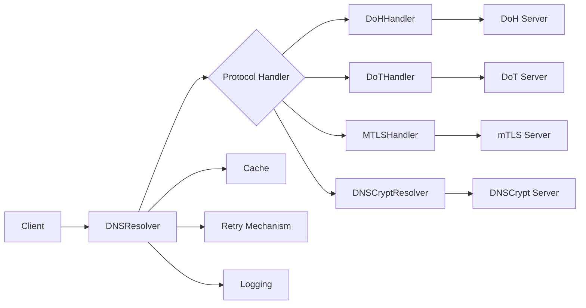
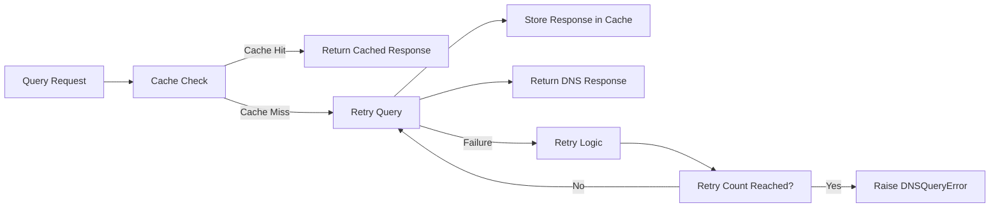
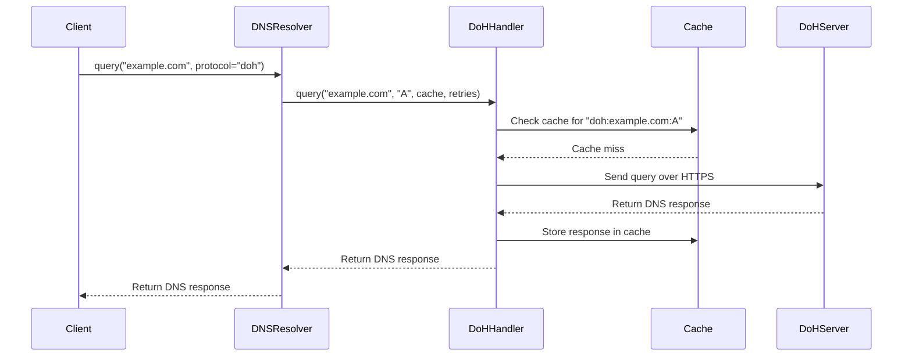

# PrivyDNS Architecture

The **PrivyDNS** library provides a robust, secure DNS querying solution with support for DNS over HTTPS (DoH), DNS over TLS (DoT), mutual TLS (mTLS), and DNSCrypt. It incorporates features such as **caching**, **retry mechanisms**, and **logging** to improve performance and reliability.

## High-Level Architecture

### Key Components
1. **Client**: Initiates DNS queries, providing a domain name and the desired protocol.
2. **DNSResolver**: The main class handling DNS queries. It maintains a registry of protocol handlers and delegates queries to the appropriate handler.
3. **Protocol Handlers**: Specialized classes implementing the `DNSProtocolHandler` abstract base class:
   - **DoHHandler**: Sends DNS queries over HTTPS (DoH) using `httpx` to communicate with the DoH server.
   - **DoTHandler**: Sends DNS queries over TLS (DoT) using `dns.query.tls` for secure communication with the DoT server.
   - **MTLSHandler**: Sends DNS queries over mutual TLS (mTLS) with client certificate authentication.
4. **DNSCryptResolver**: A separate resolver for DNSCrypt protocol that encrypts DNS queries using **NaCl**.
5. **Cache**: Stores DNS responses temporarily using a TTL-based cache to avoid re-querying the same domain repeatedly.
6. **Retry Mechanism**: Ensures that failed queries are retried a specified number of times before raising an error.
7. **Logging**: Provides detailed logs about query operations, errors, cache hits/misses, and retry attempts.

## API Overview

### `DNSResolver`
- **Purpose**: Resolves DNS queries using various secure protocols.
- **Methods**:
  - `query(domain, record_type, protocol)`: Resolves a DNS query asynchronously using the specified protocol.

### `DNSProtocolHandler` (Abstract Base Class)
- **Purpose**: Defines the interface for all DNS protocol handlers.
- **Methods**:
  - `query(domain, record_type, cache, retries)`: Abstract method implemented by concrete handlers.

### Protocol Handlers
- **DoHHandler**: Handles DNS over HTTPS queries.
- **DoTHandler**: Handles DNS over TLS queries.
- **MTLSHandler**: Handles DNS over mutual TLS queries.

### `DNSCryptResolver`
- **Purpose**: Resolves DNS queries using DNSCrypt.
- **Methods**:
  - `query(domain, record_type)`: Resolves a DNS query using DNSCrypt.

### **Error Handling**
- **DNSQueryError**: Custom exception class used to handle DNS-related errors such as query failures.

## Cache & Retry Mechanism

- **Cache**: Each protocol handler checks if the response is already cached using a protocol-specific cache key. If it is, the cached response is returned.
- **Retry**: If a DNS query fails, the protocol handler retries the query a specified number of times before raising a `DNSQueryError`.

---

## Sequence of Events (DoH Query Example)

## Conclusion

PrivyDNS is designed with **security**, **performance**, and **reliability** in mind. Its modular architecture with protocol-specific handlers allows for easy extension to support additional secure DNS protocols. The library supports encrypted DNS protocols, efficient caching, and automatic retries to ensure that DNS queries are resolved securely and quickly, with detailed logging for easier debugging.
