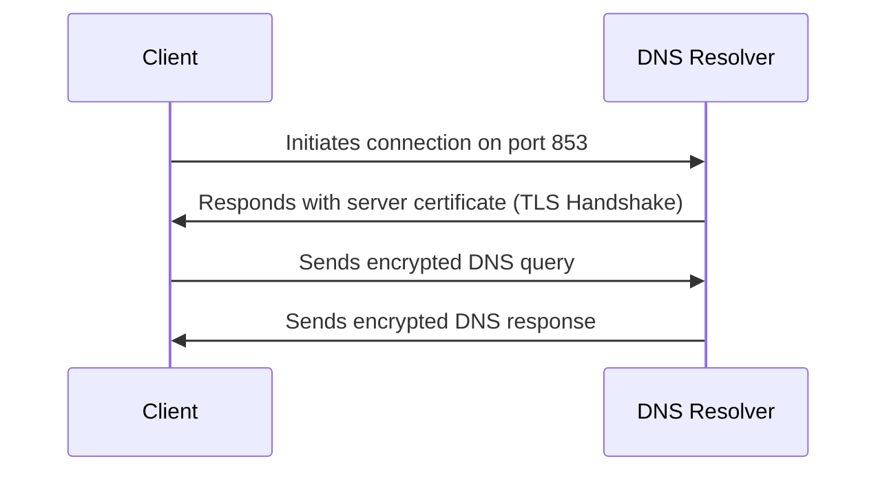
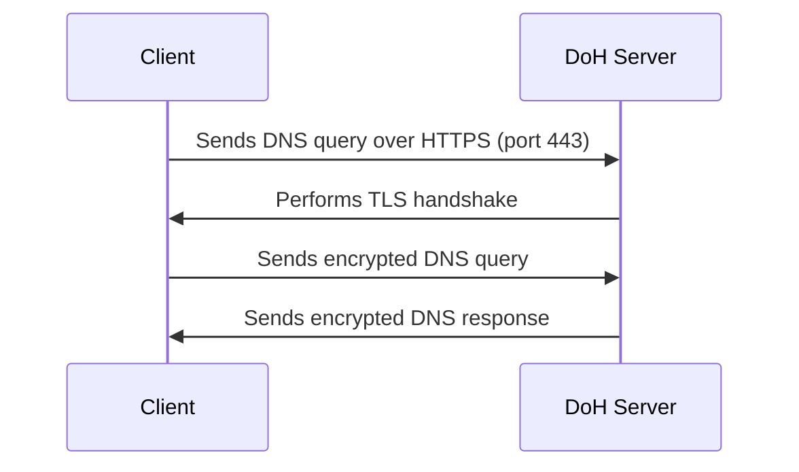
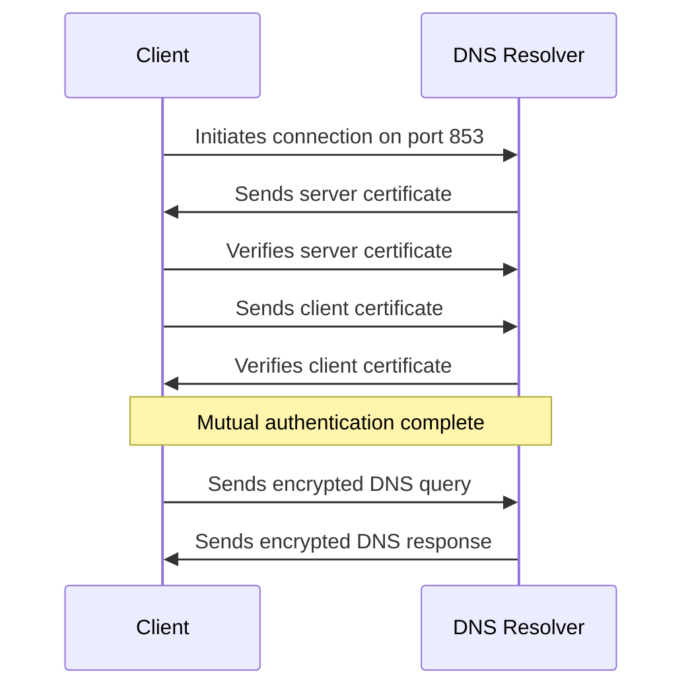
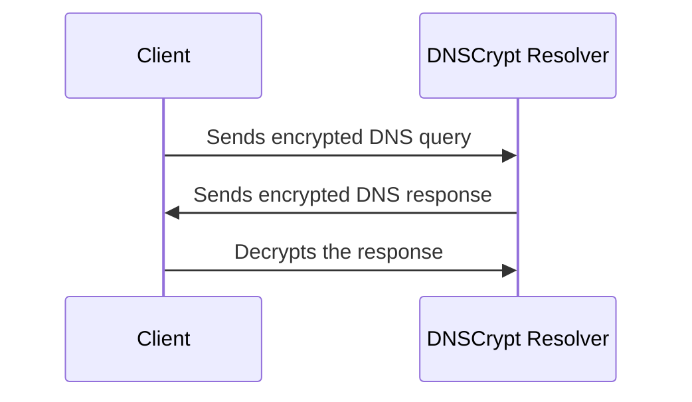

# Understanding DNS Over TLS (DoT), DNS Over HTTPS (DoH), DNS over mTLS, and DNSCrypt

## Introduction

The Domain Name System (DNS) is a critical part of the internet infrastructure, translating human-readable domain names into machine-readable IP addresses. Traditionally, DNS queries are transmitted over unencrypted UDP or TCP protocols, making them vulnerable to eavesdropping, tampering, and man-in-the-middle attacks. To address these security concerns, newer protocols such as **DNS Over TLS (DoT)**, **DNS Over HTTPS (DoH)**, and **DNSCrypt** have been introduced. These protocols aim to encrypt DNS traffic, ensuring privacy, integrity, and security.

This document explains the purpose, functioning, and benefits of DoT, DoH, and DNSCrypt, with visual diagrams to illustrate how they work.

## What is DNS Over TLS (DoT)?

**DNS Over TLS (DoT)** is a protocol for encrypting DNS queries using **Transport Layer Security (TLS)**. DoT protects the privacy and integrity of DNS requests by establishing a secure TLS connection between the client and the DNS resolver. It uses the same port (53) as traditional DNS, but the traffic is encrypted, making it harder for third parties to spy on or alter the queries.

### How DoT Works

1. **Client Initiates Connection**: The client makes a request to the DNS server over TCP, using port 853, which is reserved for DoT.
2. **TLS Handshake**: The client and server perform a TLS handshake, establishing an encrypted communication channel.
3. **Encrypted DNS Query**: The client sends the DNS query through the encrypted TLS connection.
4. **DNS Resolution**: The resolver processes the query, encrypts the response, and sends it back to the client over the same TLS connection.

### Diagram: DNS Over TLS Workflow

### Benefits of DoT

- **Encryption**: Protects the DNS query and response from being intercepted or altered.
- **Privacy**: Prevents third parties (e.g., ISPs) from tracking user browsing activity.
- **Integrity**: Ensures the DNS data has not been tampered with during transmission.

## What is DNS Over HTTPS (DoH)?

**DNS Over HTTPS (DoH)** is similar to DoT but encrypts DNS queries over **HTTPS** (HyperText Transfer Protocol Secure). DoH operates over the standard HTTPS port (443) and uses the same encryption as web traffic. This makes it harder to detect DNS traffic as it looks like regular HTTPS traffic, providing additional privacy benefits.

### How DoH Works

1. **Client Sends HTTPS Request**: The client sends a DNS query in an HTTPS request to the DoH server, using port 443.
2. **TLS Handshake**: Similar to DoT, the client and server establish an encrypted TLS connection.
3. **DNS Query**: The DNS query is encapsulated within the HTTPS request.
4. **DNS Response**: The server responds with the DNS resolution, encapsulated in an HTTPS response.

### Diagram: DNS Over HTTPS Workflow

### Benefits of DoH

- **Enhanced Privacy**: As DNS queries are sent over HTTPS, they are harder to differentiate from other web traffic, providing better privacy protection.
- **Bypass Censorship**: DoH can bypass network-level filtering and censorship because it uses port 443, which is generally open in most networks.
- **Encryption and Integrity**: Just like DoT, DoH ensures that DNS traffic is encrypted and protected from tampering.

## What is DNS Over Mutual TLS (mTLS)?

**DNS Over Mutual TLS (mTLS)** extends the security of DNS over TLS (DoT) by adding client authentication. While DoT only authenticates the server to the client, mTLS requires both the client and server to authenticate each other using X.509 certificates. This two-way authentication provides an additional layer of security, ensuring that only authorized clients can connect to the DNS server.

### How mTLS Works

1. **Client Initiates Connection**: The client initiates a connection to the DNS server over TCP, typically using port 853 (the same as DoT).
2. **Mutual TLS Handshake**:
	- The server presents its certificate to the client
	- The client verifies the server's certificate
	- The client presents its certificate to the server
	- The server verifies the client's certificate
3. **Encrypted DNS Query**: After successful mutual authentication, the client sends the DNS query through the encrypted TLS connection.
4. **DNS Resolution**: The resolver processes the query, encrypts the response, and sends it back to the client over the same TLS connection.

### Diagram: DNS Over Mutual TLS Workflow

### Benefits of mTLS

- **Enhanced Authentication**: Both client and server authenticate each other, preventing unauthorized access to the DNS service.
- **Access Control**: Allows DNS providers to restrict access to authorized clients only.
- **Encryption**: Like DoT, all DNS traffic is encrypted, protecting against eavesdropping.
- **Integrity**: Ensures DNS data has not been tampered with during transmission.
- **Mitigates DDoS Attacks**: By requiring client authentication, it helps reduce the risk of distributed denial-of-service attacks.

### Use Cases for mTLS

- **Enterprise Environments**: Organizations can ensure only company devices access their private DNS resolvers.
- **IoT Deployments**: Secure DNS resolution for Internet of Things devices with pre-installed certificates.
- **Critical Infrastructure**: Sectors requiring high security can use mTLS to ensure only trusted clients can perform DNS lookups.
- **Zero Trust Networks**: mTLS aligns with zero trust security models by requiring authentication for every connection.

## What is DNSCrypt?

**DNSCrypt** is a protocol designed to secure DNS traffic between the client and the resolver using encryption. It supports both UDP and TCP transport methods. DNSCrypt encrypts DNS queries and responses, preventing third parties from observing or tampering with DNS traffic.

DNSCrypt allows DNS resolvers to authenticate the source of the DNS response, making sure the responses are from a legitimate source, not a malicious entity.

### How DNSCrypt Works

1. **Client Initiates Query**: The client sends a DNS query to the DNSCrypt resolver.
2. **Encrypt the Query**: DNSCrypt encrypts the DNS query using strong cryptographic algorithms.
3. **Send the Query**: The encrypted DNS query is sent over UDP or TCP to the resolver.
4. **Resolver Responds**: The resolver sends back an encrypted DNS response to the client.
5. **Decrypt the Response**: The client decrypts the response and receives the DNS result.

### Diagram: DNSCrypt Workflow

### Benefits of DNSCrypt

- **Strong Encryption**: Provides encryption to protect against eavesdropping.
- **Authentication**: Ensures that the DNS response comes from a trusted and legitimate source.
- **Integrity**: Guarantees the DNS query and response have not been tampered with.

## Why Use DoT, DoH, DNSCrypt, or mTLS?

### 1. **Enhanced Privacy**
All four protocols — DoT, DoH, mTLS, and DNSCrypt — ensure that DNS queries are encrypted, preventing third parties from monitoring user activity. This protects user privacy by making it difficult for ISPs, hackers, or other entities to track websites visited by a user.

### 2. **Prevent DNS Spoofing and Man-in-the-Middle Attacks**
Since DNS queries and responses are encrypted, attackers cannot easily intercept or modify DNS traffic. This protects against attacks such as DNS spoofing, where malicious actors inject fraudulent DNS responses.

### 3. **Bypass Censorship**
DoH, in particular, is useful for bypassing DNS-level censorship and restrictions. Since it runs over HTTPS (port 443), it is difficult for network filters or firewalls to distinguish it from normal web traffic, making it harder to block.

### 4. **Improved Security**
DNSCrypt offers authentication, ensuring that the DNS response comes from a legitimate source. mTLS goes further by providing mutual authentication between client and server, ensuring that only authorized clients can access the DNS service. These mechanisms prevent attackers from providing malicious DNS responses or unauthorized access to DNS services.

### 5. **Access Control**
mTLS uniquely provides strong access control capabilities, allowing organizations to restrict DNS resolution to only authenticated clients with valid certificates. This is particularly valuable in enterprise environments, critical infrastructure, and zero-trust security models.

### 6. **Different Use Cases**
- **DoT**: Good general-purpose secure DNS with standard port (853)
- **DoH**: Excellent for bypassing censorship and blending with web traffic
- **mTLS**: Ideal for enterprise environments requiring client authentication
- **DNSCrypt**: Strong for lightweight implementations with authentication

## Conclusion

DoT, DoH, and DNSCrypt all offer enhanced security, privacy, and integrity for DNS traffic, making them crucial components of a secure internet browsing experience. While DoT and DoH use encryption to protect DNS queries, DNSCrypt adds the layer of authentication, ensuring that responses are legitimate. By implementing these protocols, users and organizations can safeguard their browsing activity from eavesdropping and tampering, improving overall security and privacy online.

## Further Reading

- [DNS Over TLS (DoT) RFC 7858](https://datatracker.ietf.org/doc/rfc7858/)
- [DNS Over HTTPS (DoH) RFC 8484](https://datatracker.ietf.org/doc/rfc8484/)
- [DNSCrypt Website](https://dnscrypt.info/)
